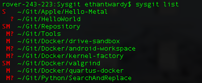
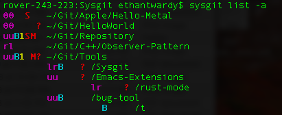

# Remember that project you forgot to finish? #

Sysgit does.

I wrote this as a tool for myself, because I have an *absurd* number of
repositories on my system (something like 80, last time I counted). Keeping
track of all of those repositories becomes a nightmare, especially when there
are so many different states that a git repository can be in, and there's only
one that you want to see:

```
On branch master
Your branch is up to date with 'origin/master'.

nothing to commit, working tree clean
```

# How to use it #

It's a fairly simple tool, with a small number of functions. The basic usage is

```
Sysgit.py [flags] <subcommand> [subcommandFlags]
```

The most useful subcommand is `list`. This subcommand checks the environment
variable `SYSGIT_PATH` (set by the user) for a colon-separated list of paths.
It searches each of these paths for a git repository and, upon finding one,
probes the repository to determine its state. If a repository is in a transient
state (i.e. it may require action by the maintainer), the script prints
information about what action may be required in the output. There is no output
for repositories that are in a stable state. The output can be a little
esoteric to read at first, but the help documentation (`Sysgit.py list -h`) is
very complete and descriptive. Shown belown are examples of the script's
output. See `Sysgit.py list -h` for more information.





Executing the script `Sysgit.py` with no arguments yields the usage
information. Running `Sysgit.py <subcommand> -h` prints useful information
about that subcommand.

The script depends on two environment variables in the shell.

- `SYSGIT_PATH`: Contains a colon separated list of paths to search for git
   repositories
- `SYSGIT_IGNORE`: Colon separated list of strings that, if appearing in the
   path of any git repository found, indicate that repository should be
   ignored.

The output can appear a little cryptic, which is why `Sysgit.py list -h`
contains information for deciphering the output:

## Getting the state of your repositories ##

Using the `list` subcommand will print the names and state of any repositories
that have changes. By default, Sysgit will only list repositories that have
changes to the local tree on the checked out branch. The status string appears
to the left of the absolute path of the repository.

If the status string contains an "S", there are changes to the local tree that
have been staged for commit. If the status string contains an "M", the local
tree contains modifications that have not been staged for commit.
If the status string contains a "?", there are untracked files in the
repository.

There are also other options to the `list` command which enable Sysgit to check
for things such as a non-empty stash, discrepancies between remote and
local refs, the existence of a [bugs](https://github.com/AmateurECE/bugs) file,
and the state of submodules, if they exist. See `Sysgit.py list -h` for more
information.

## Development ##

This project is still under development. Please submit an issue for any bug
discovered, and feel free to create a pull request if you have work to commit.
The file `bugs` contains the most up-to-date list of bugs and to-do items.
